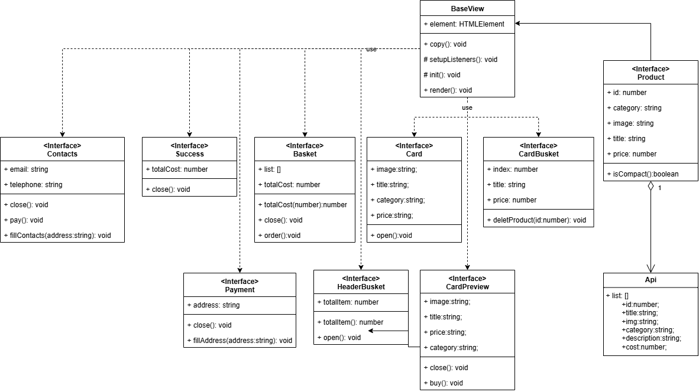

# Проектная работа "Веб-ларек"

Стек: HTML, SCSS, TS, Webpack


Архетиктура: ООП

Паттерн:MVP

Структура проекта:
- src/ — исходные файлы проекта
- src/components/ — папка с JS компонентами
- src/components/base/ — папка с базовым кодом
- src/types/components/view/ — папка с типами отображаемых компонентов 
- src/types/common/ — папка с типами переиспользуемых компонентов
- src/types/model/ — папка с типами состояния модели Данных
- src/types/base/ — папка с типами базового кода

Важные файлы:
- src/pages/index.html — HTML-файл главной страницы
- src/types/index.ts — файл с типами
- src/index.ts — точка входа приложения
- src/scss/styles.scss — корневой файл стилей
- src/utils/constants.ts — файл с константами
- src/utils/utils.ts — файл с утилитами

Компоненты проекта:
- src/types/components/view/Basket.ts - Файл с интерфейсом для корзины товаров в модальном окне
- src/types/components/view/Card.ts - Файл с интерфейсом для карточки на главной странице
- src/types/components/view/CardBasket.ts - Файл с интерфейсом карточки в модальном окне корзины
- src/types/components/view/CardPreview.ts - Файл с интерфейсом карточки в модальном окне товара
- src/types/components/view/Contacts.ts - Файл с интерфейсом для модального окна контактов
- src/types/components/view/HeaderBasket.ts - Файл с интерфейсом для корзины товаров в блоке header
- src/types/components/view/Payment.ts - Файл с интерфейсом для модального окна выбора способа оплаты
- src/types/components/view/Product.ts - Файл с интерфейсом для  товара 
- src/types/components/view/Success.ts - Файл с интерфейсом для модального окна успешной оплаты
Базовое отоброжения компонентов проекта на страницу:
- src/types/base/BaseView.ts - Файл с классом для базового отображения на страницу компонентов 

## Установка и запуск
Для установки и запуска проекта необходимо выполнить команды

```
npm install
npm run start
```

или

```
yarn
yarn start
```
## Сборка

```
npm run build
```

или

```
yarn build
```
## UML-схема
